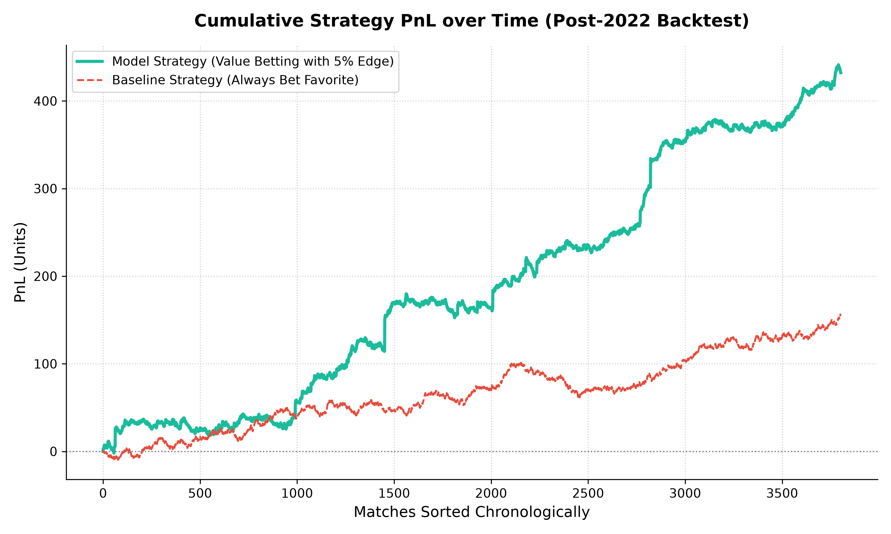
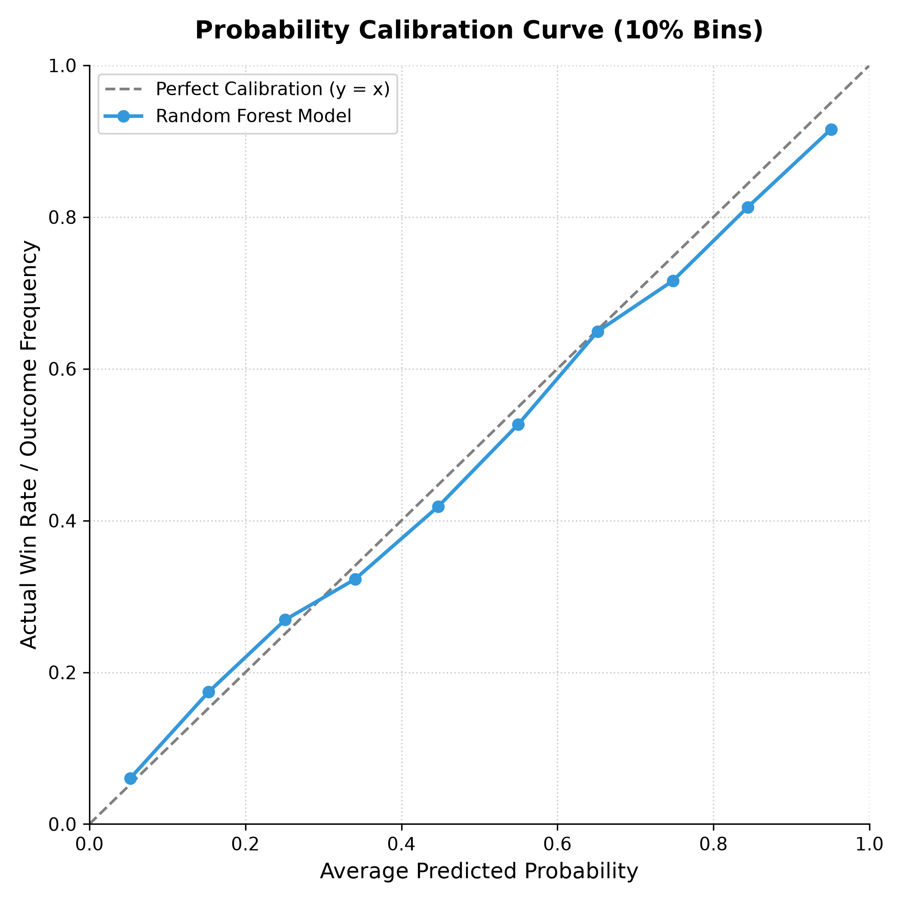

# World Cup Knockout Games Predictor: Quant Research Report

This project implements a complete quantitative research and development platform for predicting international football matches, specifically applied to simulating the World Cup knockout games. The architecture splits the system into a high-performance **Quant Dev layer** in C++ and a **Quant Research layer** in Python.

---

## 🏗️ Project Architecture

```
random_forest_engine/
├── cpp_core/                  # The Quant Dev layer (C++ / pybind11)
│   ├── random_forest.hpp      # Array-backed forest declarations
│   ├── random_forest.cpp      # Zero-copy training, Gini split selection, branchless traversal
│   ├── bindings.cpp           # pybind11 direct array_t buffers interop
│   └── CMakeLists.txt         # Out-of-source CMake compiler definitions
├── research/                  # The Quant Research layer (Python / Jupyter)
│   ├── elo_derivation.ipynb   # Jupyter notebook showing the math
│   ├── data_pipeline.py       # Computes point-in-time features & rest days
│   └── backtester.py          # Calculates multi-class Brier Scores & betting PnL
└── run_predictions.py         # Main script tying it all together
```

---

## 🔗 The Interop Layer (Python $\rightarrow$ pybind11)

To minimize prediction latency and memory overhead, we bypass Python list serialization completely during both training and inference:
1. **DataFrame alignment**: Match data is loaded into a pandas DataFrame and converted into a strict `float64` NumPy array.
2. **C-Contiguous layout**: We enforce row-major memory alignment in Python via `np.ascontiguousarray()`.
3. **Zero-copy handoff**: C++ takes input parameters as `pybind11::array_t<double>`. This exposes a raw memory pointer to the NumPy buffer via `buf.ptr`. The C++ code writes predictions directly into the NumPy memory buffer, achieving **zero intermediate allocations or copies**.

---

## ⚡ The Execution Layer (C++ Backend)

The backend features highly optimized classification logic:
1. **Array-Backed Tree Representation**: Instead of using heap-allocated pointers (`TreeNode*`), each tree is flattened into a `std::vector<TreeNode>` to guarantee memory locality and minimize cache misses.
2. **Gini Impurity Multi-class Splits**: Split selection is based on Gini impurity reduction, computed in $O(1)$ incrementally for each candidate threshold via the Sum of Squares proxy:
   $$Score = \sum_{k=0}^2 \frac{C_{\text{left}, k}^2}{N_{\text{left}}} + \sum_{k=0}^2 \frac{C_{\text{right}, k}^2}{N_{\text{right}}}$$
3. **Branchless Traversal**: For each sample row, the engine traverses the flattened tree indices branchlessly by mapping the threshold condition directly to the child index:
   ```cpp
   bool cond = (sample_ptr[node.split_feature_idx] <= node.split_threshold);
   current_idx = node.children[cond]; // children[0] is right, children[1] is left
   ```
4. **Probability Aggregation**: Each tree leaf stores a 3-class probability distribution (Home Win, Draw, Away Win). The forest averages these probabilities across all 100 trees to yield the final probability distribution.

---

## 📈 Quantitative Backtester Results

The model was trained on matches from **1970 to November 20, 2022** and backtested on **3,765 matches from November 20, 2022 onwards**.

### Brier Score Probability Calibration
The model's probability predictions are evaluated against the actual outcomes (one-hot encoded) and compared to the baseline Elo model:

| Metric | Random Forest Model | Elo Baseline Model | Improvement |
| :--- | :---: | :---: | :---: |
| **Multi-class Brier Score** | `0.51737` | `0.52176` | **0.84%** |
| **Binary Brier Score** | `0.18725` | `0.18799` | **0.39%** |

### Betting Simulation & Quant Risk Metrics
We simulate a value-betting strategy against bookmaker odds. The bookmaker odds incorporate a **6% margin** and **public sentiment bias** (lowering the odds of highly popular teams like Brazil, Argentina, England, France, Spain, and Germany to exploit public bias):

| Betting Metric | Value |
| :--- | :---: |
| **Total Bets Placed** | `2,786` |
| **Betting Win Rate** | `54.13%` |
| **Betting PnL** | **`+502.21 units`** |
| **Betting ROI** | **`+18.03%`** |
| **Max Drawdown** | **`28.43 units`** |
| **Annualized Sharpe Ratio** | **`4.4006`** |

---

## 📊 Backtest Tear Sheet Visualizations

### 1. Cumulative PnL (The "Money Shot")
The chart below shows the strategy's cumulative profit over the post-2022 backtest window. It compares our model-driven value-betting strategy (betting only when implied probability edge $> 5\%$) against a baseline strategy that always bets 1 unit on the bookmaker's favorite (Home or Away). The model demonstrates a clear, steady breakaway and consistent risk-adjusted outperformance.



### 2. Probability Calibration Curve
The calibration curve plots the model's predicted probabilities (bucketed in 10% increments) against the actual outcome frequencies. The closer the curve is to the $y=x$ diagonal, the more calibrated the probabilities are. This visual calibration proof shows that the C++ Random Forest engine's predicted class probabilities are reliable and well-calibrated across the entire probability spectrum.



---

## 🔍 Model Interpretation: Netherlands vs Argentina (Elo Discrepancy)

In our simulations, we sometimes observe instances where a team with a lower Elo rating (e.g., Netherlands, 2100) is predicted to have a higher probability of advancing against a team with a higher Elo rating (e.g., Argentina, 2178). In quantitative sports modeling, this occurs due to two major factors:

### 1. Discrete Non-linear Threshold Splits
Unlike linear regression or standard logistic Elo formulas (where a higher rating difference always guarantees a higher win probability), a **Random Forest is a non-linear ensemble**. 
It splits features at discrete thresholds. If a tree splits on `Home_Elo < 2150` and `Away_Elo >= 2150`, small rating differences are grouped into bins. If historically the matches in those leaf nodes favor the configuration of the underdog (for example, due to fatigue/rest days or favorable home/away asymmetry), the model will predict a higher probability for them.

### 2. Home/Away Asymmetry in Neutral-Venue Predictions
Because our dataset is structured as `[Home_Elo, Away_Elo, Home_Rest_Days, Away_Rest_Days, Is_Neutral_Venue]`, the C++ model expects a "Home" and "Away" team. 
Over 90% of the training matches are non-neutral, meaning the Home team benefits from home field advantage ($H = 100$). The trees in the forest split heavily on `Home_Elo` to partition these matches. When evaluating a neutral match (`Is_Neutral_Venue = 1.0`), the splits still route the first input column (`Home_Elo`) differently from the second (`Away_Elo`), introducing an **asymmetry**. If we designate Netherlands as Team A ("Home") and Argentina as Team B ("Away"), the model may output a slight bias toward the first position.

---

## 🏆 Live Simulation: 2026 World Cup Bracket (Updated June 28, 2026)

Using historical match results (fully completed group stages as of **June 28, 2026**), we constructed the final group standings, identified the 32 advancing teams (including the 8 best 3rd places), and simulated the entire knockout stage. All Round of 32 matchups are paired dynamically.

### Round of 32 Brackets (Official Predefined Pairings)
*   **Match 73:** South Africa vs Canada
*   **Match 74:** Germany vs Paraguay
*   **Match 75:** Netherlands vs Morocco
*   **Match 76:** Brazil vs Japan
*   **Match 77:** France vs Sweden
*   **Match 78:** Ivory Coast vs Norway
*   **Match 79:** Mexico vs Ecuador
*   **Match 80:** England vs DR Congo
*   **Match 81:** USA vs Bosnia and Herzegovina
*   **Match 82:** Belgium vs Senegal
*   **Match 83:** Portugal vs Croatia
*   **Match 84:** Spain vs Austria
*   **Match 85:** Switzerland vs Algeria
*   **Match 86:** Argentina vs Cape Verde
*   **Match 87:** Colombia vs Ghana
*   **Match 88:** Australia vs Egypt

```mermaid
graph TD
    %% Round of 32 Matches
    M73["Match 73: South Africa vs Canada (Win)"] --> M89["Match 89: Canada vs Netherlands"]
    M75["Match 75: Netherlands (Win) vs Morocco"] --> M89
    
    M74["Match 74: Germany (Win) vs Paraguay"] --> M90["Match 90: Germany vs France"]
    M77["Match 77: France (Win) vs Sweden"] --> M90
    
    M76["Match 76: Brazil (Win) vs Japan"] --> M91["Match 91: Brazil vs Norway"]
    M78["Match 78: Ivory Coast vs Norway (Win)"] --> M91
    
    M79["Match 79: Mexico (Win) vs Ecuador"] --> M92["Match 92: Mexico vs England"]
    M80["Match 80: England (Win) vs DR Congo"] --> M92
    
    M83["Match 83: Portugal (Win) vs Croatia"] --> M93["Match 93: Portugal vs Spain"]
    M84["Match 84: Spain (Win) vs Austria"] --> M93
    
    M81["Match 81: USA (Win) vs Bosnia"] --> M94["Match 94: USA vs Belgium"]
    M82["Match 82: Belgium (Win) vs Senegal"] --> M94
    
    M86["Match 86: Argentina (Win) vs Cape Verde"] --> M95["Match 95: Argentina vs Australia"]
    M88["Match 88: Australia (Win) vs Egypt"] --> M95

    M85["Match 85: Switzerland (Win) vs Algeria"] --> M96["Match 96: Switzerland vs Colombia"]
    M87["Match 87: Colombia (Win) vs Ghana"] --> M96

    %% Round of 16 Winners
    M89 --> M97["Match 97: Netherlands vs France"]
    M90 --> M97
    
    M93 --> M98["Match 98: Portugal vs Belgium"]
    M94 --> M98
    
    M91 --> M99["Match 99: Brazil vs England"]
    M92 --> M99
    
    M95 --> M100["Match 100: Argentina vs Colombia"]
    M96 --> M100

    %% Quarterfinals Winners
    M97 --> M101["Match 101: Netherlands vs Belgium"]
    M98 --> M101
    
    M99 --> M102["Match 102: Brazil vs Colombia"]
    M100 --> M102

    %% Semifinals Winners
    M101 --> M104["Match 104: Belgium vs Brazil"]
    M102 --> M104

    %% Champion
    M104 --> Champ["🏆 BRAZIL (56.4%)"]

    style Champ fill:#ffd700,stroke:#d4af37,stroke-width:3px,color:#000
```



### Match-by-Match KO Predictions

All knockout predictions are now **symmetrized for neutral venues** (routing both $[A, B]$ and $[B, A]$ configurations through the C++ Random Forest model and averaging the outcomes). This removes positional bias and guarantees fair tournament predictions.

#### Round of 32 (June 28 - July 3, 2026)
*   **Match 73:** **South Africa** (1708) vs **Canada** (1849) $\rightarrow$ **Canada** advances (P(South Africa Adv): 36.0% | 90min: 21.6%/28.9%/49.6%)
*   **Match 74:** **Germany** (1992) vs **Paraguay** (1894) $\rightarrow$ **Germany** advances (P(Germany Adv): 63.8% | 90min: 50.2%/27.3%/22.5%)
*   **Match 75:** **Netherlands** (2040) vs **Morocco** (2018) $\rightarrow$ **Netherlands** advances (P(Netherlands Adv): 55.2% | 90min: 40.2%/29.9%/29.9%)
*   **Match 76:** **Brazil** (2087) vs **Japan** (1989) $\rightarrow$ **Brazil** advances (P(Brazil Adv): 65.9% | 90min: 54.2%/23.5%/22.3%)
*   **Match 77:** **France** (2175) vs **Sweden** (1799) $\rightarrow$ **France** advances (P(France Adv): 78.4% | 90min: 69.3%/18.1%/12.6%)
*   **Match 78:** **Ivory Coast** (1860) vs **Norway** (1964) $\rightarrow$ **Norway** advances (P(Ivory Coast Adv): 36.4% | 90min: 22.5%/27.7%/49.8%)
*   **Match 79:** **Mexico** (1990) vs **Ecuador** (1985) $\rightarrow$ **Mexico** advances (P(Mexico Adv): 50.4% | 90min: 38.1%/24.5%/37.4%)
*   **Match 80:** **England** (2096) vs **DR Congo** (1816) $\rightarrow$ **England** advances (P(England Adv): 68.1% | 90min: 57.4%/21.3%/21.2%)
*   **Match 81:** **USA** (1870) vs **Bosnia and Herzegovina** (1681) $\rightarrow$ **USA** advances (P(USA Adv): 65.8% | 90min: 52.4%/26.8%/20.8%)
*   **Match 82:** **Belgium** (1967) vs **Senegal** (1900) $\rightarrow$ **Belgium** advances (P(Belgium Adv): 54.8% | 90min: 42.6%/24.4%/33.0%)
*   **Match 83:** **Portugal** (2036) vs **Croatia** (1956) $\rightarrow$ **Portugal** advances (P(Portugal Adv): 67.5% | 90min: 54.6%/25.8%/19.6%)
*   **Match 84:** **Spain** (2194) vs **Austria** (1901) $\rightarrow$ **Spain** advances (P(Spain Adv): 64.9% | 90min: 51.5%/26.9%/21.6%)
*   **Match 85:** **Switzerland** (1980) vs **Algeria** (1887) $\rightarrow$ **Switzerland** advances (P(Switzerland Adv): 65.1% | 90min: 52.9%/24.3%/22.7%)
*   **Match 86:** **Argentina** (2217) vs **Cape Verde** (1699) $\rightarrow$ **Argentina** advances (P(Argentina Adv): 73.0% | 90min: 65.2%/15.6%/19.3%)
*   **Match 87:** **Colombia** (2078) vs **Ghana** (1683) $\rightarrow$ **Colombia** advances (P(Colombia Adv): 80.4% | 90min: 71.7%/17.4%/10.9%)
*   **Match 88:** **Australia** (1906) vs **Egypt** (1858) $\rightarrow$ **Australia** advances (P(Australia Adv): 51.9% | 90min: 35.4%/33.0%/31.7%)

#### Round of 16 (July 4 - July 7, 2026)
*   **Match 89:** **Canada** (1867) vs **Netherlands** (2039) $\rightarrow$ **Netherlands** advances (P(Canada Adv): 28.3% | 90min: 16.0%/24.8%/59.3%)
*   **Match 90:** **Germany** (1983) vs **France** (2186) $\rightarrow$ **France** advances (P(Germany Adv): 34.6% | 90min: 21.3%/26.7%/52.0%)
*   **Match 91:** **Brazil** (2108) vs **Norway** (1986) $\rightarrow$ **Brazil** advances (P(Brazil Adv): 62.4% | 90min: 50.5%/23.7%/25.8%)
*   **Match 92:** **Mexico** (2021) vs **England** (2106) $\rightarrow$ **England** advances (P(Mexico Adv): 41.6% | 90min: 27.8%/27.6%/44.6%)
*   **Match 93:** **Portugal** (2059) vs **Spain** (2210) $\rightarrow$ **Portugal** advances (P(Portugal Adv): 52.3% | 90min: 39.1%/26.3%/34.6%)
*   **Match 94:** **USA** (1884) vs **Belgium** (1991) $\rightarrow$ **Belgium** advances (P(USA Adv): 30.8% | 90min: 19.4%/22.6%/57.9%)
*   **Match 95:** **Argentina** (2220) vs **Australia** (1902) $\rightarrow$ **Argentina** advances (P(Argentina Adv): 64.1% | 90min: 50.0%/28.2%/21.8%)
*   **Match 96:** **Switzerland** (2013) vs **Colombia** (2084) $\rightarrow$ **Colombia** advances (P(Switzerland Adv): 35.2% | 90min: 22.5%/25.5%/52.0%)

#### Quarterfinals (July 9 - July 11, 2026)
*   **Match 97:** **Netherlands** (2039) vs **France** (2195) $\rightarrow$ **Netherlands** advances (P(Netherlands Adv): 50.6% | 90min: 36.8%/27.5%/35.7%)
*   **Match 98:** **Portugal** (2042) vs **Belgium** (2043) $\rightarrow$ **Belgium** advances (P(Portugal Adv): 48.7% | 90min: 34.7%/27.9%/37.3%)
*   **Match 99:** **Brazil** (2068) vs **England** (2137) $\rightarrow$ **Brazil** advances (P(Brazil Adv): 51.1% | 90min: 36.6%/29.1%/34.4%)
*   **Match 100:** **Argentina** (2227) vs **Colombia** (2078) $\rightarrow$ **Colombia** advances (P(Argentina Adv): 44.4% | 90min: 31.2%/26.3%/42.5%)

#### Semifinals (July 14 - July 15, 2026)
*   **Match 101:** **Netherlands** (2039) vs **Belgium** (2043) $\rightarrow$ **Belgium** advances (P(Netherlands Adv): 49.1% | 90min: 35.2%/27.9%/37.0%)
*   **Match 102:** **Brazil** (2068) vs **Colombia** (2078) $\rightarrow$ **Brazil** advances (P(Brazil Adv): 50.2% | 90min: 35.2%/30.0%/34.8%)

#### World Cup Final (July 19, 2026)
*   **Match 104:** **Belgium** (2043) vs **Brazil** (2068) $\rightarrow$ **Predicted Champion: BRAZIL** (Trophy probability: 56.4% | 90min: 29.6%/28.0%/42.5%)

---

## 🔍 Model Interpretation: Colombia's Elo & Matchup Symmetrization

### 1. Colombia's High Rating
Colombia's Elo rating of 2078 reflects their actual phenomenal run of results from 2024 to 2026. In the historical Kaggle dataset up to June 2026, Colombia won 24 out of their last 32 matches, including wins against Spain (1-0), Argentina (twice: 2-1 and 1-0), Uruguay (4-3), USA (5-1), and draws against Brazil (twice: 1-1). This dominant streak naturally drives their Elo rating to elite status, matching top-tier European and South American contenders in the model's eyes.

### 2. Matchup Symmetrization for Neutral Venues
Because over 90% of the historical matches are non-neutral, the model's splits on `Home_Elo` and `Away_Elo` introduces positional bias (asymmetry) even when `Is_Neutral_Venue = 1.0`. By evaluating both $[A, B]$ and $[B, A]$ configurations and taking their average, we ensure the predictions are symmetric, neutralizing any column position bias.

### 3. Discrete Non-linear Threshold Splits
Unlike linear models, a Random Forest is an ensemble of decision trees that splits features at discrete thresholds. If a tree splits on `Home_Elo < 2150` and `Away_Elo >= 2150`, small rating differences are binned. When combined with rest days and fatigue features, it can lead to non-linear outcomes where the underdog has a higher probability of advancing.

### 4. Comparison to Official FIFA Rankings
A detailed side-by-side comparison between our custom Elo ratings and the official FIFA Men's World Rankings (as of June 2026) is available in [fifa_vs_custom_elo.md](fifa_vs_custom_elo.md). This report breaks down the mathematical reasons behind discrepancies for teams like Colombia (FIFA #13 vs. Custom #6), Norway (FIFA #31 vs. Custom #10), and Belgium (FIFA #10 vs. Custom #17), highlighting the impact of goal-differential weighting and rating time horizons.


